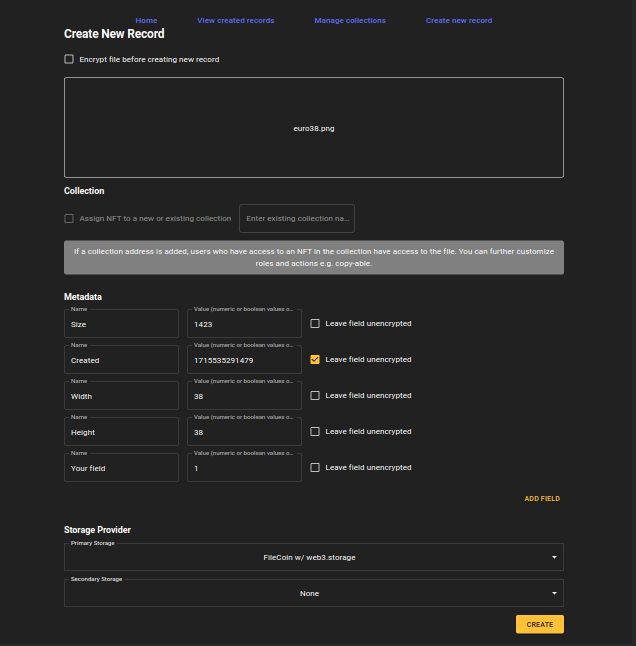

# fhe-drm
On chain DRM system using Zama's fhEVM

[](https://vimeo.com/950060614)

## How it works

An asset is encrypted (using AES) and uploaded to decentralized storage, with a URI pointing to this asset. An NFT is then created for the asset, along with an encryption key and encrypted metadata. The NFT owner has access to the decryption key to view the original file.

This scenario expands with a collection contract containing NFTs, users, and roles. Each NFT in a collection can be restricted, accessible only by users with the required roles. This allows for additional features like creating temporary copies, links, and monitoring access. When a user has the required role, the decryption key is provided, enabling access to the content. However, this approach isn't ideal, as the decryption algorithm could be rewritten using FHE to run without exposing the key. Finally, only the decrypted file is made available.

In the current implementation, the encryption key is generated from a numeric seed. However, due to overflow issues, the entire 32-byte key cannot be stored inside the smart contract as 4 euint64.

## Run locally

``` bash
# Start node locally
cd fhevm-hardhat-template
pnpm i
pnpm fhevm:start

# Start frontend (separate terminal)
cd drm
npm i
npm run dev
```

When creating the first record, you will have to create a w3up account, see [this](https://web3.storage/docs/how-to/create-account/)

